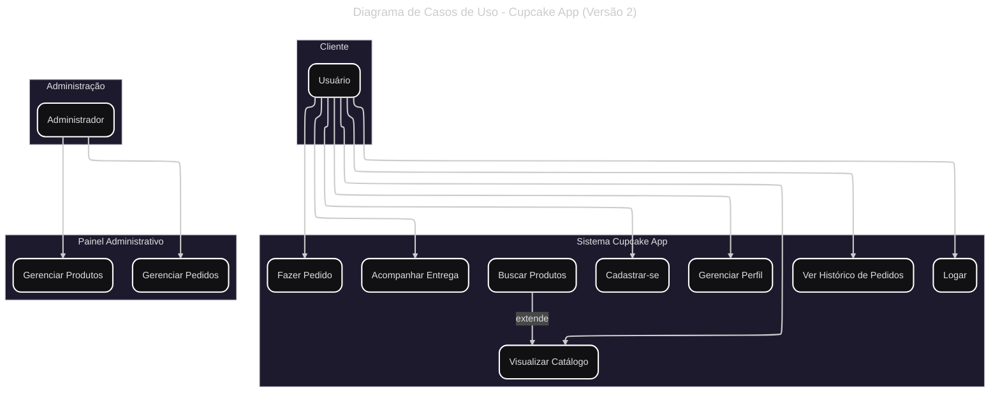

# Código Mermaid para o Casos de Uso v2.0

Este documento contém o código-fonte para o Casos de Uso do projeto, utilizando a sintaxe Mermaid.

```mermaid
---
config:
  layout: elk
  theme: redux-dark
title: Diagrama de Casos de Uso - Cupcake App (Versão 2)
---

flowchart TD
subgraph Cliente["Cliente"]
direction LR
U("Usuário")
end
subgraph subGraph1["Sistema Cupcake App"]
UC1("Cadastrar-se")
UC2("Logar")
UC3("Gerenciar Perfil")
UC4("Visualizar Catálogo")
UC5("Buscar Produtos")
UC6("Fazer Pedido")
UC7("Acompanhar Entrega")
UC8("Ver Histórico de Pedidos")
end
subgraph s1["Administração"]
direction LR
A("Administrador")
end
subgraph subGraph3["Painel Administrativo"]
UC9("Gerenciar Produtos")
UC10("Gerenciar Pedidos")
end
U --> UC1 & UC2 & UC3 & UC4 & UC6 & UC7 & UC8
UC5 -- extende --> UC4
A --> UC9 & UC10
```
