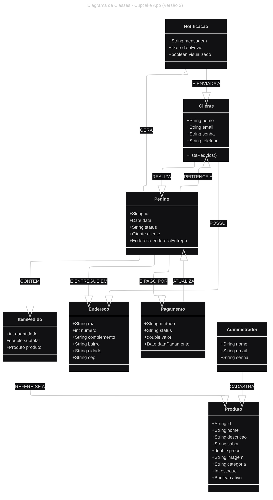

# Código Mermaid para o Diagrama de Classes v2.0

Este documento contém o código-fonte para o Diagrama de Classes do projeto, utilizando a sintaxe Mermaid.

```mermaid
---
config:
  layout: elk
  theme: redux-dark
title: Diagrama de Classes - Cupcake App (Versão 2)
---

classDiagram
direction TB
class Cliente {
+String nome
+String email
+String senha
+String telefone
+listaPedidos()
}
class Pedido {
+String id
+Date data
+String status
+Cliente cliente
+Endereco enderecoEntrega
}
class ItemPedido {
+int quantidade
+double subtotal
+Produto produto
}
class Produto {
+String id
+String nome
+String descricao
+String sabor
+double preco
+String imagem
+String categoria
+Int estoque
+Boolean ativo
}
class Endereco {
+String rua
+int numero
+String complemento
+String bairro
+String cidade
+String cep
}
class Pagamento {
+String metodo
+String status
+double valor
+Date dataPagamento
}
class Notificacao {
+String mensagem
+Date dataEnvio
+boolean visualizado
}
class Administrador {
+String nome
+String email
+String senha
}
Cliente --|> Pedido : REALIZA
Pedido --|> Cliente : PERTENCE A
Cliente --|> Endereco : POSSUI
Pedido --|> ItemPedido : CONTÉM
ItemPedido --|> Produto : REFERE-SE A
Pedido --|> Endereco : É ENTREGUE EM
Pedido --|> Pagamento : É PAGO POR
Pagamento --|> Pedido : ATUALIZA
Notificacao <|-- Pedido : GERA
Notificacao --|> Cliente : É ENVIADA A
Administrador --|> Produto : CADASTRA
```
