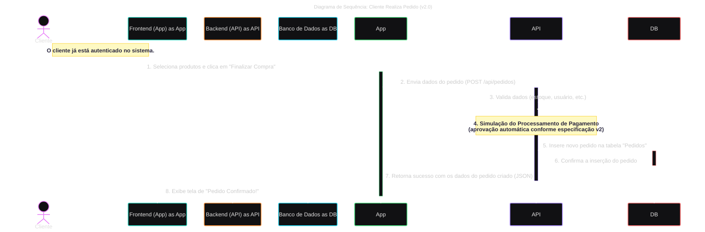

# Código Mermaid para o Diagrama de Sequência v2.0

Este documento contém o código-fonte para o Diagrama de Sequência do projeto, utilizando a sintaxe Mermaid.

```mermaid
---
config:
  theme: redux-dark-color
---

sequenceDiagram
%% Diagrama de Sequência
title Diagrama de Sequência: Cliente Realiza Pedido (v2.0)

    %% Definição dos Participantes (Camadas da Arquitetura)
    actor Cliente
    participant Frontend (App) as App
    participant Backend (API) as API
    participant Banco de Dados as DB

    %% Início do Fluxo
    Note right of Cliente: O cliente já está autenticado no sistema.

    Cliente->>+App: 1. Seleciona produtos e clica em "Finalizar Compra"
    App->>+API: 2. Envia dados do pedido (POST /api/pedidos)

    API->>API: 3. Valida dados (estoque, usuário, etc.)

    Note over API: 4. Simulação do Processamento de Pagamento<br/>(aprovação automática conforme especificação v2)

    API->>+DB: 5. Insere novo pedido na tabela "Pedidos"
    DB-->>-API: 6. Confirma a inserção do pedido

    API-->>-App: 7. Retorna sucesso com os dados do pedido criado (JSON)
    App-->>-Cliente: 8. Exibe tela de "Pedido Confirmado!"
```
