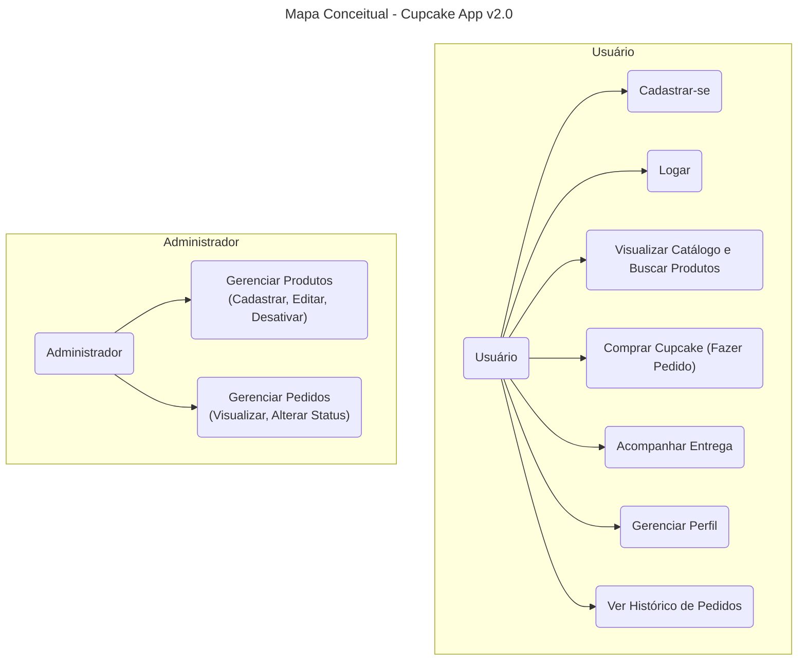

# Código Mermaid para o Mapa Conceitual v2.0

Este documento contém o código-fonte para o Mapa Conceitual do projeto, utilizando a sintaxe Mermaid.

```mermaid
---
title: Mapa Conceitual - Cupcake App v2.0
---
graph TD
    subgraph "Usuário"
        U(Usuário)
        UC1("Cadastrar-se")
        UC2("Logar")
        UC3("Visualizar Catálogo e Buscar Produtos")
        UC4("Comprar Cupcake (Fazer Pedido)")
        UC5("Acompanhar Entrega")
        UC6("Gerenciar Perfil")
        UC7("Ver Histórico de Pedidos")

        U --> UC1
        U --> UC2
        U --> UC3
        U --> UC4
        U --> UC5
        U --> UC6
        U --> UC7
    end

    subgraph "Administrador"
        A(Administrador)
        AC1("Gerenciar Produtos<br/>(Cadastrar, Editar, Desativar)")
        AC2("Gerenciar Pedidos<br/>(Visualizar, Alterar Status)")

        A --> AC1
        A --> AC2
    end
```
