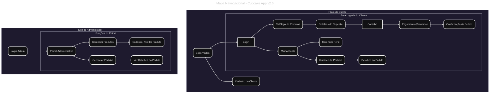

# Código Mermaid para o Mapa Navegacional v2.0

Este documento contém o código-fonte para o Mapa Navegacional do projeto, utilizando a sintaxe Mermaid.

```mermaid
---
config:
  theme: redux-dark
title: Mapa Navegacional - Cupcake App v2.0
---

flowchart TD
subgraph Fluxo do Cliente
BoasVindas("Boas-vindas") --> Login
BoasVindas --> Cadastro("Cadastro de Cliente")
subgraph "Área Logada do Cliente"
Login --> Catalogo("Catálogo de Produtos")
Login --> MinhaConta("Minha Conta")
Catalogo --> Detalhes("Detalhes do Cupcake") --> Carrinho --> Pagamento("Pagamento (Simulado)") --> Confirmacao("Confirmação do Pedido")
MinhaConta --> GerenciarPerfil("Gerenciar Perfil")
MinhaConta --> HistoricoPedidos("Histórico de Pedidos") --> DetalhesPedido("Detalhes do Pedido")
end
end
subgraph Fluxo do Administrador
LoginAdmin("Login Admin") --> Painel("Painel Administrativo")
subgraph "Funções do Painel"
Painel --> GerenciarProdutos("Gerenciar Produtos")
Painel --> GerenciarPedidos("Gerenciar Pedidos")
GerenciarProdutos --> CadastroEdicaoProduto("Cadastrar / Editar Produto")
GerenciarPedidos --> DetalhesPedidoAdmin("Ver Detalhes do Pedido")
end
end
```
